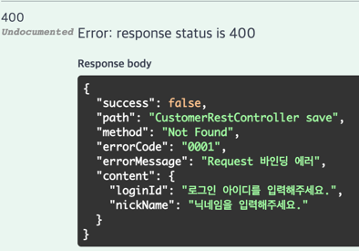
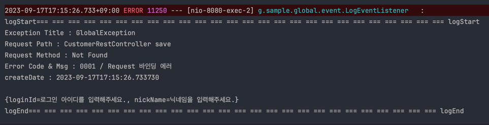
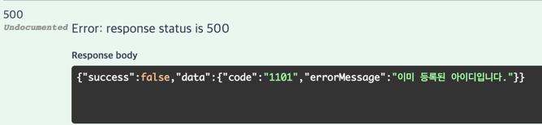
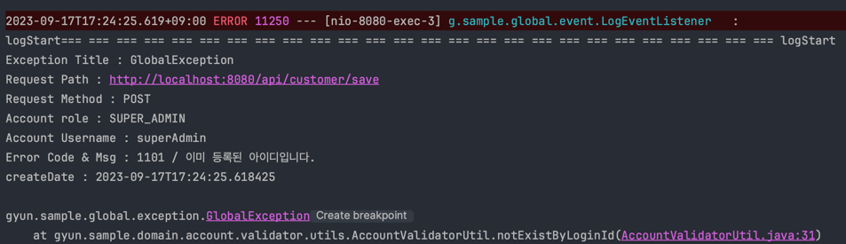

# sample

프로젝트를 처음 시작할때 기본적인 세팅을 스킵하기 위한 프로젝트

아주 간단한 관리자,유저 CRUD 까지만 구현

자바 17  및 스프링부트 3.0.5 버전 사용

스웨거 경로
http://localhost:8080/swagger-ui/index.html#

RestApi 프로젝트

화면은 리액트로 구성

올바르지 않은 RequestData를 보내면 400에러를 반환하도록 구현
BindingResult가 메소드에 포함되어 있다면 AOP를 적용한 BindingAdvice를 통해 에러를 처리하도록 구현

https://blog.naver.com/skarbs01/223210410721

예외처리는 @RestControllerAdvice 및 @ExceptionHandler를 사용하여 구현

예외처리시 @EventListener를 사용하여 로그를 남기도록 구현

로그인 기능은 JWT 로 구현 RefreshToken은 Redis에 저장

https://blog.naver.com/skarbs01/223210430457

카카오 로그인의 경우 OpenFeign을 이용하여 카카오 공식문서를 보고 구현하였습니다.

https://blog.naver.com/skarbs01/223213988052

/ 경로에 소켓을 이용한 기본적인 익명채팅 기능 구현
